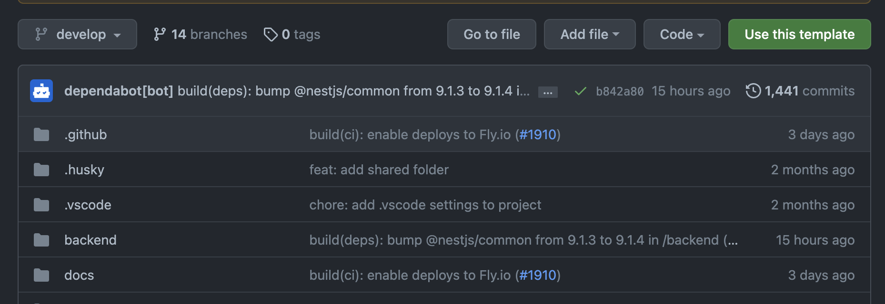
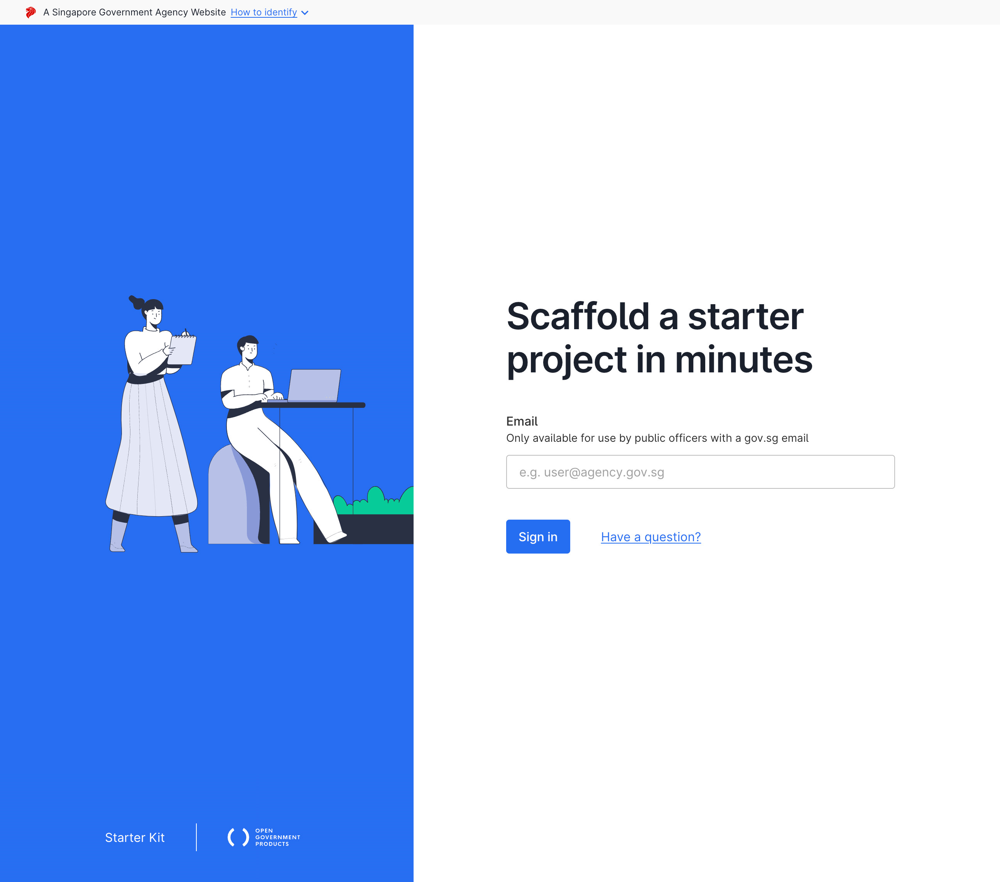

# TypeScript Project Files Template for OGP

A template used by [Open Government Products](https://open.gov.sg)
to build new products

## Quickstart

```
# Clone this repo if you're trying this out, or start a new repo with
# ts-template as a template and clone that if starting a new product

git clone git@github.com:opengovsg/ts-template
cd ts-template
npm install
npm run dev
```

## Getting Started

This guide should equip you with the basics you’ll need to build and
launch a simple product, using this as a starting point, even if you
don’t have a background in software engineering.

### Preparation - installing software

You will need the following:

- A [GitHub account](https://github.com/signup)
- [Docker Desktop](https://www.docker.com/), which is used to run some
  supporting applications during your development process
  - If you are using an M1 or M2 Mac, ensure you download
    Docker Desktop for Apple Silicon
- An application to edit files, like Microsoft's [Visual Studio Code](https://code.visualstudio.com/)
- A client to interact with GitHub, like its [official desktop client](https://desktop.github.com/)
- Some familiarity with using the [Terminal in Mac OS X](https://www.youtube.com/watch?v=aKRYQsKR46I)
- [Volta](https://volta.sh/), by entering into the Terminal the
  commands listed on their homepage
- Open a new Terminal, and type the following to install:
  - Node.js - `volta install node`
  - npm - `volta install npm`

### Getting and Preparing the Code in Your Computer

- Create a [new repository](https://github.com/new), using
  opengovsg/ts-template as a template
  - From this page, click `Use this template`
    
  - Choose a name for your new repository
- Use [GitHub Desktop](https://docs.github.com/en/desktop/contributing-and-collaborating-using-github-desktop/adding-and-cloning-repositories/cloning-and-forking-repositories-from-github-desktop)
  (or your preferred tool) to clone your newly-created repository into
  your computer
  - Remember the directory that you cloned to.  
    You will need this for the next step.
  - If you are using a Mac, open the directory in Finder,
    then press command-option-c to copy the directory path to memory
- Open a new terminal, and type `cd <path-to-repository>`
- Run the command `npm install`
  - This pulls in third-party packages for the codebase, which it
    depends on to run (ie, dependencies)
- In the same terminal, run `npm run dev` to verify that the application
  has been prepared correctly. Your browser should display the following:  
  

## Further Reading

Take time to understand the codebase and what you have to work with
to further develop your product.

- An index to all the documentation can be found [here](./docs/).
- README for the frontend application can be found [here](./frontend/README.md)
- In a hurry to launch your product? Go straight to [deploying](./docs/deploying/)
