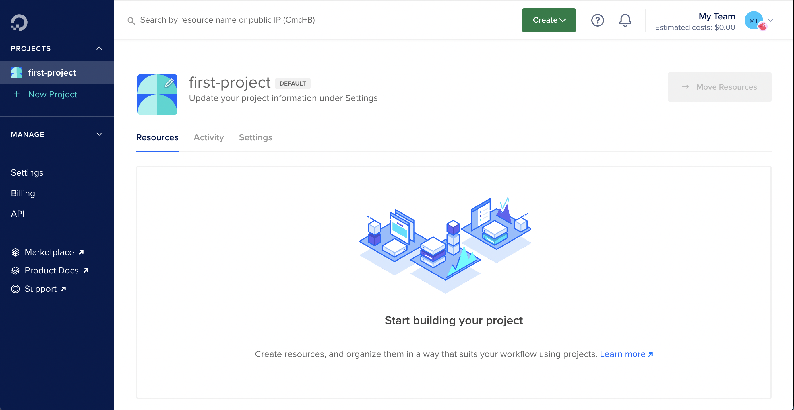
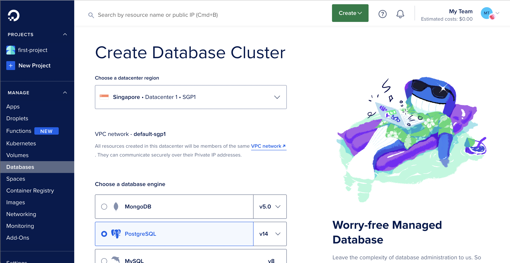
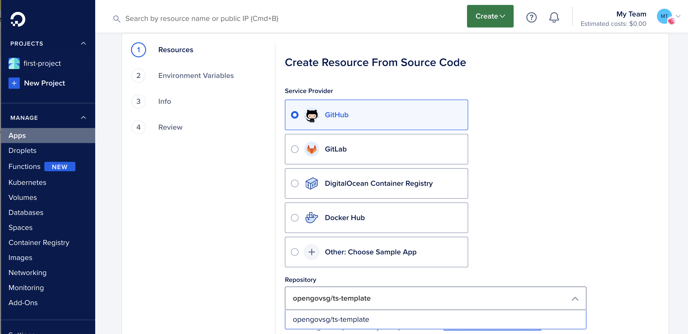
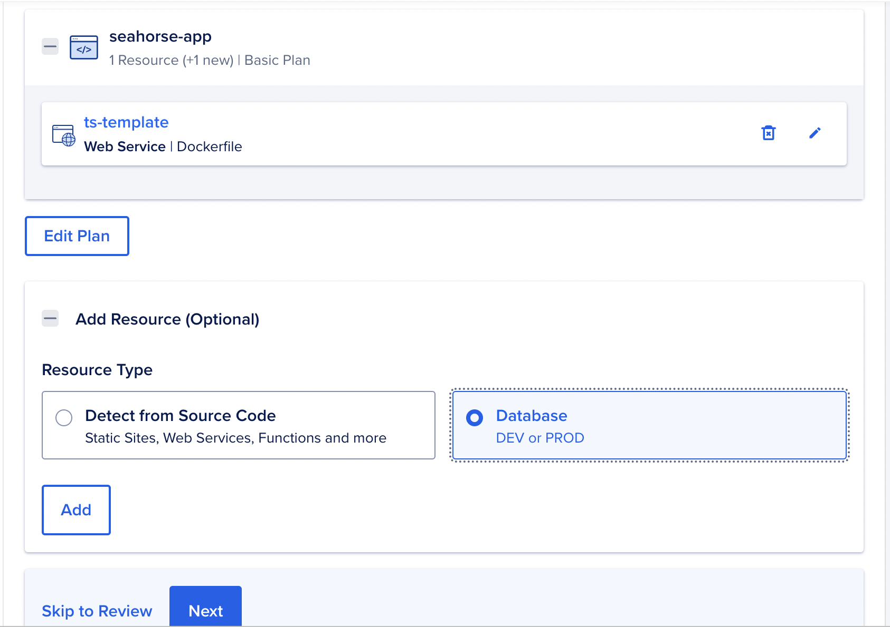
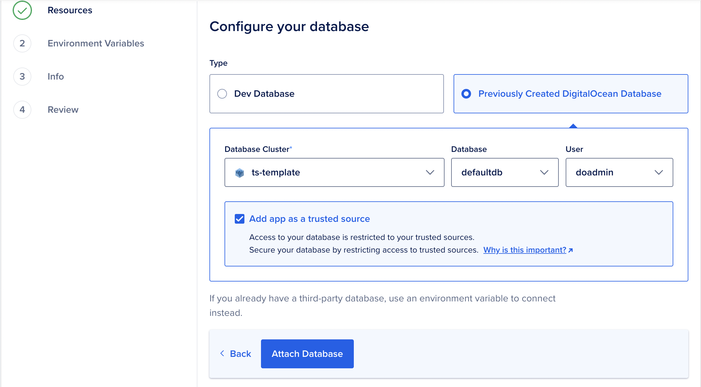
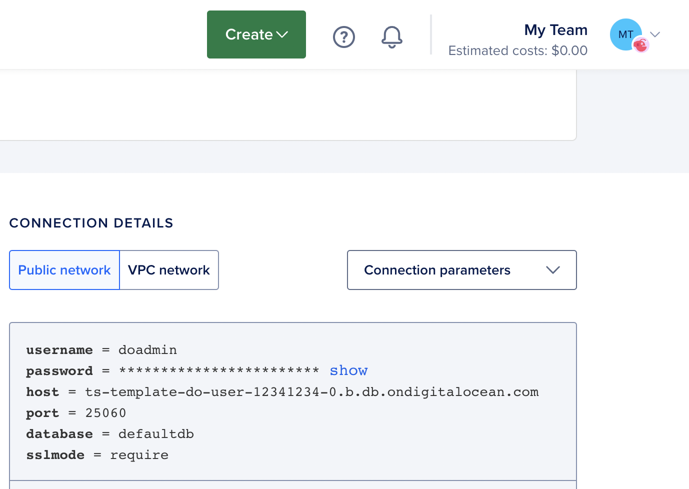
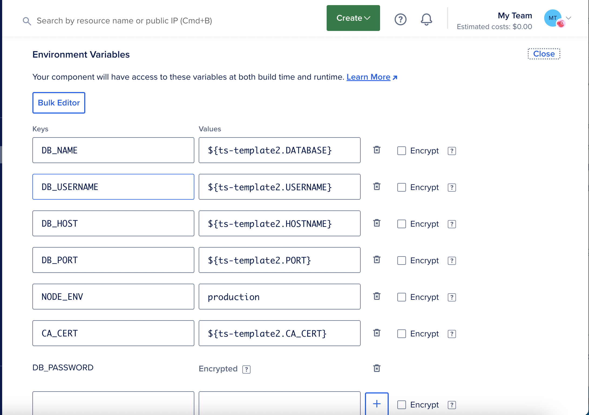

# Deploying Your Application - A Guide For Everyone

Learn how to prepare your application to take it from your development 
environment to a simple deployment environment

## Infrastructure

We use DigitalOcean to allow for straightforward management of 
infrastructure. This is especially helpful for teams with few 
engineers, so that they can focus on building better product.

You will need a credit card to sign up for DigitalOcean.

### DigitalOcean Set-up

On initial login to DigitalOcean, the user will be presented with the 
following screen:

Create a new database cluster, selecting the Singapore datacentre
and PostgreSQL as the engine:

In a new tab, create a new App on DigitalOcean by clicking Create App, 
followed by Manage Access. Ensure that the DigitalOcean GitHub App 
(integration) is installed on both your personal GitHub account as 
well as the GitHub organisation containing the repo to deploy[^1].

Click Next. Ensure Resources consist of a Web Service read from the 
Dockerfile, with 2GB RAM. Add a database as a resource.

Under Configure Your Database, add your Previously Created DigitalOcean
Database.

Edit the application's environment variables.

Go back to the database tab, and copy each connection parameter to the 
corresponding environment variable as shown in the screenshots below.
Also add `NODE_ENV`, and set that to `production`.

(If you wish to use email OTPs for your application, sign up for an email
service like SendGrid, then input the mail connection parameters as
the relevant environment variables documented [here](../../backend/src/config/config.schema.ts).

Click ahead to Review, then Create Resources

## References
[^1]: https://www.digitalocean.com/community/questions/how-to-properly-link-github-repositories-in-app-platform
