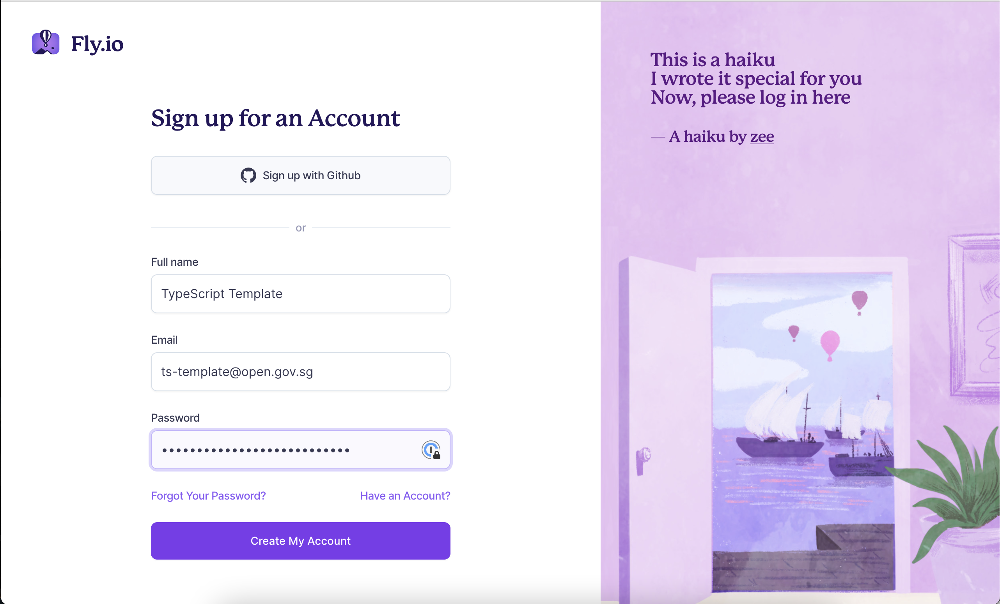
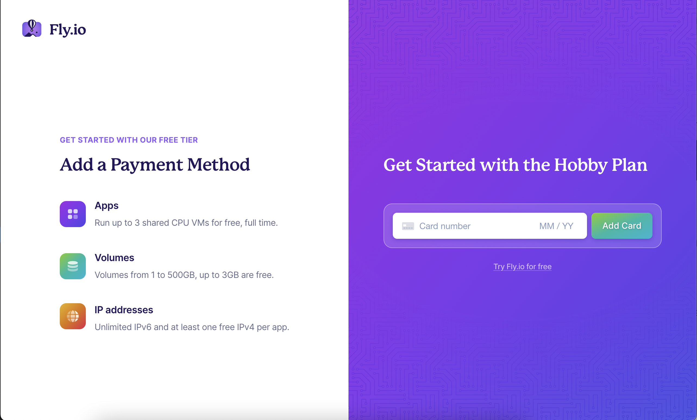
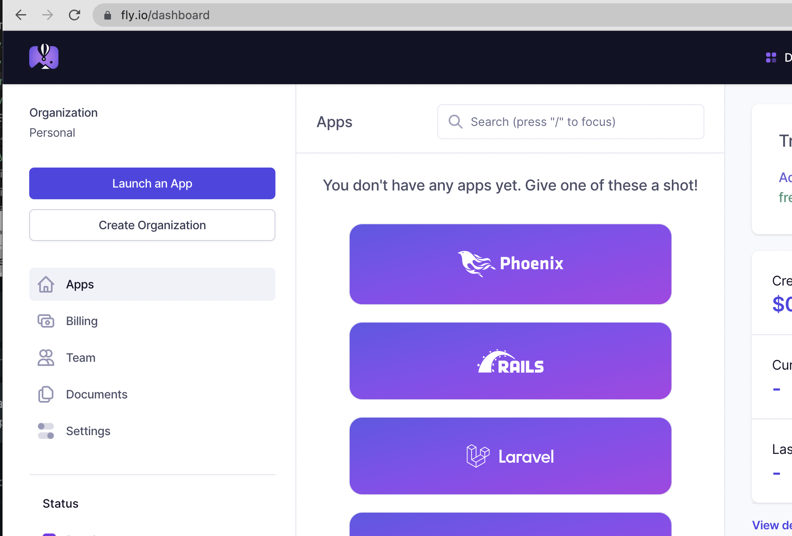
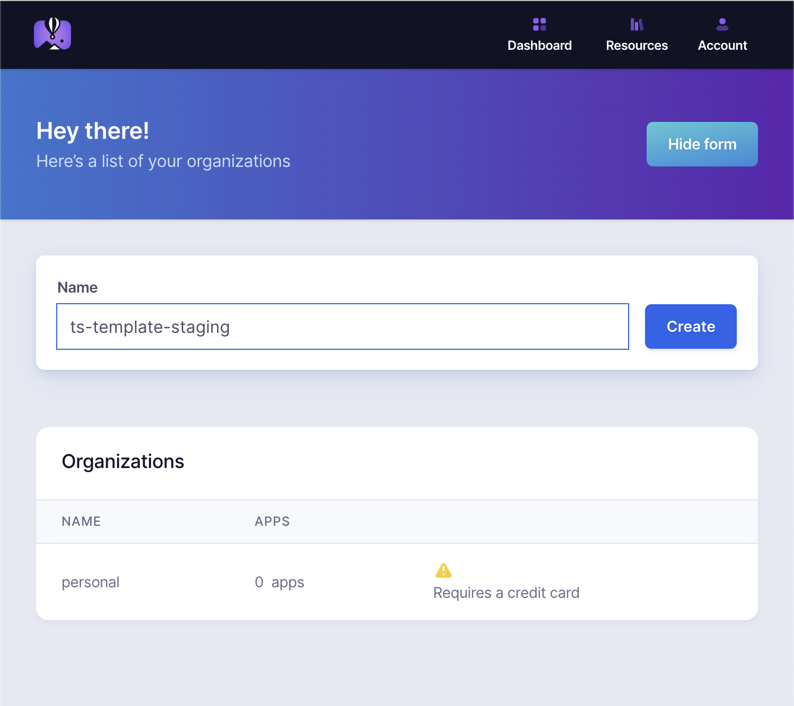
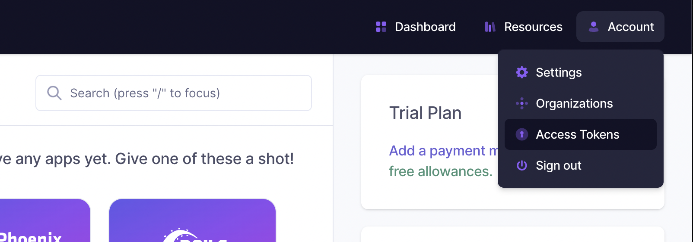
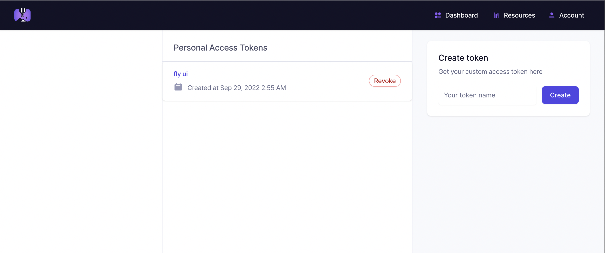
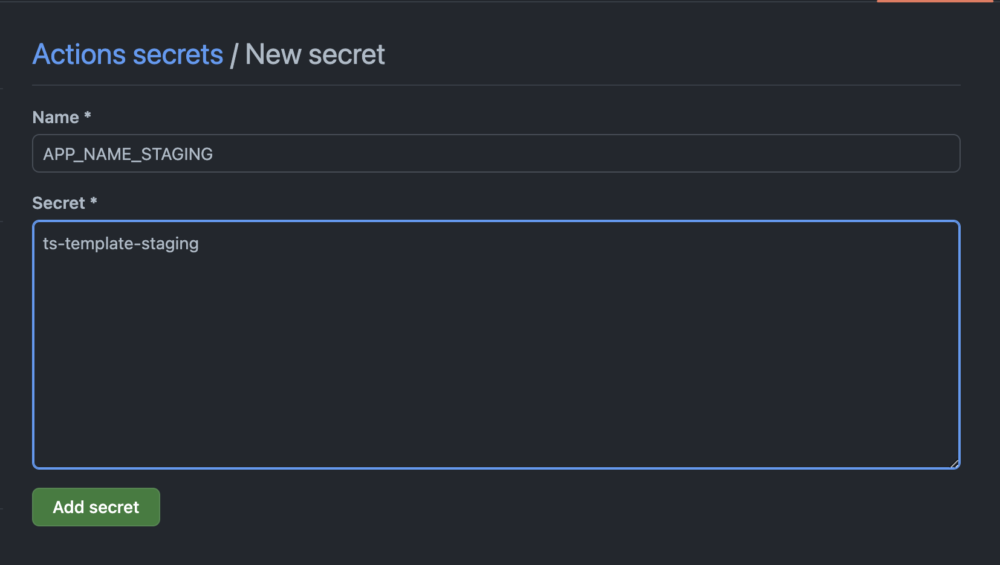
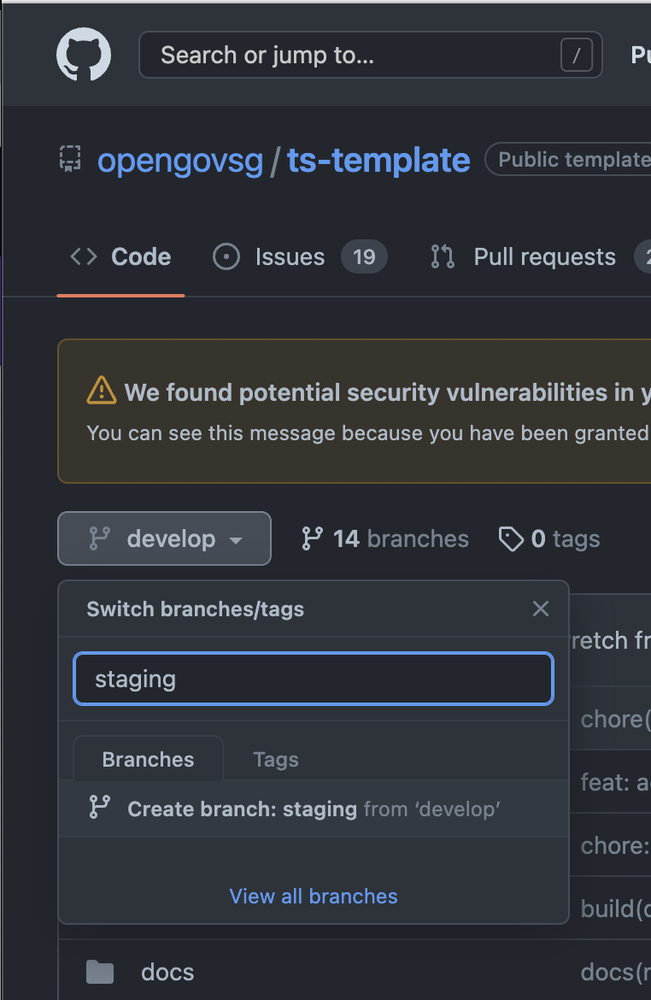
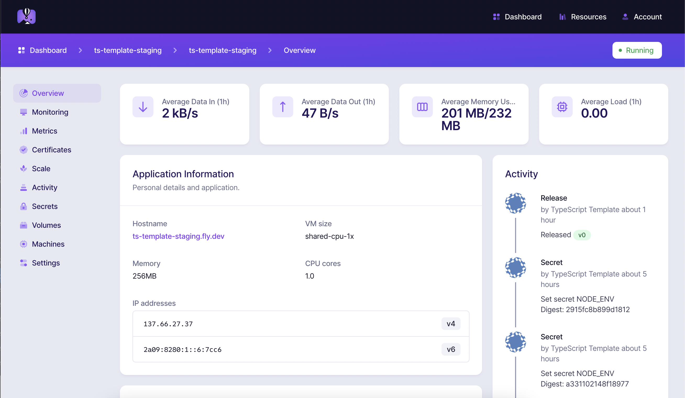
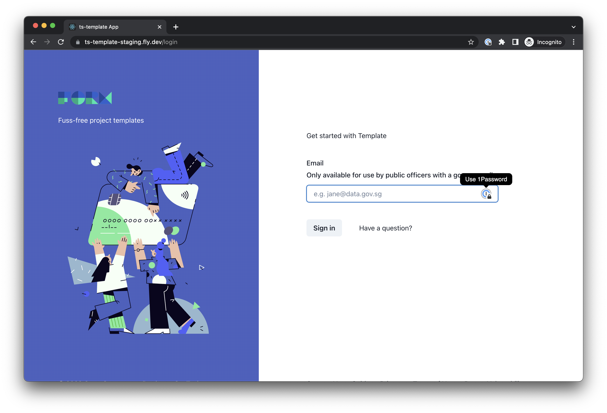

# Deploying Your Application - A Guide For Hustlers

Learn how to prepare your application to take it from your development 
environment to a simple deployment environment, without any
financial resources

## Prerequisites

Some familiarity with using the [Terminal in Mac OS X](https://www.youtube.com/watch?v=aKRYQsKR46I)
is assumed. This is the best way to your product get up and running
on Fly.io, and is covered by their official documentation.

## Infrastructure

We use fly.io to allow for straightforward management of 
infrastructure. This is especially helpful for individuals without
any backing from engineers or finance.

### Signing up for Fly.io

Visit [Fly.io](https://fly.io), and follow instructions to 
[Get Started](https://fly.io/docs/hands-on/). We will be following
just the steps up till we sign up for an account.

One of the steps in the instructions will get you to sign up for
an account:

```
$ flyctl auth signup
Opening https://fly.io/app/auth/cli/f2d7.....3465c ...

Waiting for session...
```

This will take you to their [sign-up page](https://fly.io/app/sign-up).
Create a new sign up using an email address (preferably a group email
representing the product team).



Save the new account credentials in 1Password or your preferred
password manager. Verify the email address as needed.

When prompted to go with a payment plan, locate the link to try
Fly.io for free. In the screenshot below, the link is below the
input for a credit card.



Your Terminal should now look like this:

```
$ flyctl auth signup
Opening https://fly.io/app/auth/cli/f2d7.....3465c ...

Waiting for session... Done
successfully logged in as <account-email>
$
```

### Preparing the environment

Go to the Fly.io [dashboard](https://fly.io/dashboard), and create two 
organizations, one for your staging environment, and one for your 
production one. Use the naming convention `appname-environmentname`





Go to the Terminal, and run the command `flyctl deploy --org <orgname>`.
Taking care to choose a name that is unique to the product as well as
the environment it is in, answer the prompts as shown in the example 
below:

```
$ fly launch --org ts-template-staging
An existing fly.toml file was found for app <APP_NAME>
? Would you like to copy its configuration to the new app? Yes
Creating app in /opengovsg/ts-template
Scanning source code
Detected a Dockerfile app
? App Name (leave blank to use an auto-generated name): ts-template-staging
? Select region: sin (Singapore)
Created app ts-template-staging in organization ts-template-staging
Wrote config file fly.toml
? Would you like to set up a Postgresql database now? Yes
For pricing information visit: https://fly.io/docs/about/pricing/#postgresql-clusters
? Select configuration: Development - Single node, 1x shared CPU, 256MB RAM, 1GB disk
Creating postgres cluster ts-template-staging-db in organization ts-template-staging
Postgres cluster ts-template-staging-db created
  Username:    postgres
  Password:    <redacted-value-here>
  Hostname:    ts-template-staging-db.internal
  Proxy Port:  5432
  PG Port: 5433
Save your credentials in a secure place -- you won't be able to see them again!

Monitoring Deployment

1 desired, 1 placed, 1 healthy, 0 unhealthy [health checks: 3 total, 3 passing]
--> v0 deployed successfully

Connect to postgres
Any app within the ts-template-staging organization can connect to postgres using the above credentials and the hostname "ts-template-staging-db.internal."
For example: postgres://postgres:<redacted-value-here>@ts-template-staging-db.internal:5432

Now that you've set up postgres, here's what you need to understand: https://fly.io/docs/reference/postgres-whats-next/
WARN The running flyctl agent (v0.0.395) is older than the current flyctl (v0.0.398).
WARN The out-of-date agent will be shut down along with existing wireguard connections. The new agent will start automatically as needed.

Postgres cluster ts-template-staging-db is now attached to ts-template-staging
The following secret was added to ts-template-staging:
  DATABASE_URL=postgres://ts_template_staging:<another-redacted-value-here>@top2.nearest.of.ts-template-staging-db.internal:5432/ts_template_staging
Postgres cluster ts-template-staging-db is now attached to ts-template-staging
? Would you like to deploy now? No
Your app is ready. Deploy with `flyctl deploy`
```

There are two sets of database connection parameters given. One is to 
be used for general administration of the database, and one is to be 
used by the application. Save both into 1Password or your preferred 
password manager.

Ask an engineer if you need help identifying and saving the connection
parameters.

Add the parameters using [flyctl secrets](https://fly.io/docs/reference/secrets/) 
as follows:

```
$ flyctl secrets import --app ts-template-staging
DB_NAME=ts_template_staging
DB_USERNAME=ts_template_staging
DB_HOST=top2.nearest.of.ts-template-staging-db.internal
DB_PASSWORD=<another-redacted-value-here>
NODE_ENV=staging
<Press the Control and D keys; this finishes user input>

Secrets are staged for the first deployment
```

(If you wish to use email OTPs for your application, sign up for an email
service like SendGrid, then input the mail connection parameters as
the relevant environment variables documented [here](../../backend/src/config/config.schema.ts).


### Deploying with GitHub Actions

From the dashboard, go to [Account -> Access Tokens](https://fly.io/user/personal_access_tokens)





Create a new token named `github-actions`. This token will only be shown
once to you; save this in 1Password or your preferred password manager.

From your GitHub repository page, under Settings -> Secrets -> Actions,
add the following secrets:

- `APP_NAME_STAGING`
- `APP_NAME_PROD`
- `FLY_API_TOKEN`



Create a new branch `staging` from the branch containing the code to 
be deployed:


### Deploying Locally
If you are impatient and want to deploy straight from your local machine,
run the following command:

```
flyctl deploy --app <your app name> --dockerfile Dockerfile.fly
```
### Ready for Users

Your product would then be found on the URL found on the app dashboard:




